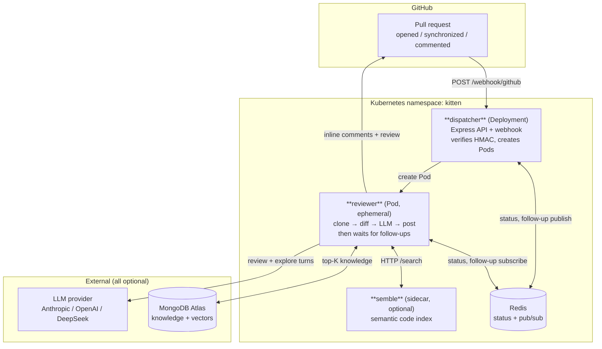

# Kitten

**A self-hosted, vendor-agnostic AI code review agent.** Kitten runs one ephemeral
Kubernetes Pod per pull request, gives it an isolated clone of your repository, and
lets it review the diff with full repo context — then posts its findings as inline
GitHub review comments and stays online to answer follow-up questions.

[](LICENSE)
[](package.json)
[](#testing)

```
PR opened ──► webhook ──► dispatcher ──► reviewer Pod ──► inline review comments
                                              │
                                              └── stays alive for @reviewer follow-ups
```

---

## Table of contents

- [Why Kitten](#why-kitten)
- [How it works](#how-it-works)
- [Quick start](#quick-start)
- [Deploy to AWS EKS](#deploy-to-aws-eks)
- [Using the reviewer](#using-the-reviewer)
- [Configuration](#configuration)
- [Documentation](#documentation)
- [Project layout](#project-layout)
- [Testing](#testing)
- [Project status](#project-status)
- [Contributing](#contributing)
- [License](#license)

---

## Why Kitten

Most AI review bots are SaaS: your code leaves your network, you get the vendor's
model, and you configure what the vendor decided to expose. Kitten inverts that.

| | Kitten |
|---|---|
| **Where it runs** | Your Kubernetes cluster. Source never leaves your infrastructure. |
| **Which model** | Anthropic, OpenAI, or any Anthropic/OpenAI-compatible endpoint (DeepSeek ships as the default). Chosen per repository. |
| **Isolation** | One Pod per review, one clone per Pod, `restartPolicy: Never`, clone dir removed even on crash. |
| **Branding** | White-label. The trigger word, the language of the output, and the review rules are yours. |
| **Depth** | Reads more than the diff: full file contents, repo-wide search, git history, semantic search, and a knowledge base your team teaches by hand. |
| **Access** | Strictly read-only. There is no write tool in the agent's tool layer, by construction. |

## How it works



**The lifecycle of one review:**

1. **Trigger.** A `pull_request` webhook (`opened`, `reopened`, `synchronize`) reaches
   `POST /webhook/github`. The signature is verified against the raw request bytes
   before the payload is even parsed.
2. **Dispatch.** The dispatcher builds a deterministic Pod name —
   `review-{owner}-{repo}-{prNumber}` — creates the Pod through the Kubernetes API,
   and writes the initial `queued` status to Redis.
3. **Review.** The Pod clones the repo at the PR head branch, diffs
   `origin/{base}...origin/{head}`, reads the changed files, loads the repo's
   `.reviewer.yml`, injects any stored repository knowledge, and calls the LLM.
4. **Report.** Findings are posted as a GitHub Pull Request Review. Each finding that
   lands inside a diff hunk becomes an inline comment; the rest go into a Markdown
   table in the review body, so nothing is silently dropped.
5. **Stay.** The Pod does not exit. It subscribes to a Redis channel and answers
   `@reviewer <question>` comments with the review still in context, re-runs on new
   pushes, and shuts itself down after an idle timeout (default 10 minutes).
6. **Clean up.** The clone directory is removed in a `finally` block — on success,
   on failure, on crash.

Two review strategies exist. The default **monolithic** path sends the diff plus the
full contents of every changed file in one call, splitting into chunks when the
content exceeds the token budget. The opt-in **agentic** path sends only the diff and
a file index, then lets the model pull what it needs through read-only tools —
`read_file`, `search`, `find_related`, `list_directory`, `git_log`, `git_blame`,
`semantic_search`. See [docs/agentic-review.md](docs/agentic-review.md).

## Quick start

### Prerequisites

| Requirement | Version | Needed for |
|---|---|---|
| Node.js | >= 20 | building and testing |
| pnpm | >= 9 | workspace management |
| Docker + Compose | any recent | local dispatcher + Redis + Mongo |
| minikube | >= 1.30 | running an actual review |
| GitHub token | classic or fine-grained, `repo` scope | cloning and posting comments |
| LLM API key | one of Anthropic / OpenAI / DeepSeek | the review itself |
| MongoDB Atlas + Voyage key | — | *optional*, enables the knowledge store |

### Build and test

```bash
pnpm install
pnpm build     # tsc -b across all packages (project references)
pnpm test      # vitest, all three packages
pnpm lint      # eslint
```

### Option A — dispatcher + Redis in Docker (no cluster)

Fast loop for routes, validation and health checks. **Reviews are not runnable here:**
`POST /review` answers `503` because there is no Kubernetes API to create Pods.

```bash
docker compose up -d --build
curl http://localhost:3001/health
# → {"status":"ok","redis":"connected"}
docker compose down
```

### Option B — full stack on minikube (runs real reviews)

```bash
pnpm build     # REQUIRED FIRST: the reviewer image copies packages/*/dist,
               # which is gitignored and produced only by this step

GITHUB_TOKEN=<token> ANTHROPIC_API_KEY=<key> DEEPSEEK_API_KEY=<key> \
  ./scripts/minikube-setup.sh
```

The script starts minikube, applies the namespace/RBAC/Redis/PVC manifests, seeds the
Secrets from your exported environment variables, builds all three images inside
minikube's own Docker daemon, and rolls out the dispatcher. It prints the generated
webhook secret once — copy it.

```bash
DISPATCHER_URL=$(minikube service kitten-dispatcher -n kitten --url)

curl -X POST "$DISPATCHER_URL/review" \
  -H "Content-Type: application/json" \
  -d '{"repo":"owner/repo","prNumber":2,"headRef":"feature","baseRef":"main","sender":"me"}'
# → {"jobId":"review-owner-repo-2","status":"queued"}

kubectl --context=minikube logs review-owner-repo-2 -n kitten
curl "$DISPATCHER_URL/status/review-owner-repo-2"
```

> **Always pin the `kubectl` context explicitly.** These commands create namespaces,
> RBAC and Secrets, and a developer kubeconfig may well be pointing at production. The
> operator scripts default to `--context=minikube`; override with
> `KUBE_CONTEXT=<name>`.

Full deployment guide, including wiring the GitHub webhook through a public tunnel:
[docs/deployment.md](docs/deployment.md).

### Option C — EKS cluster (automated CI deploys)

Run Kitten on a real Amazon EKS cluster. The cluster itself must exist (created
with `eksctl`/Terraform or the console); everything inside it is bootstrapped
**once** by a script, after which every push to the deploy branch (`master`)
deploys automatically.

```bash
# One-time bootstrap (prerequisites: aws, eksctl, kubectl, admin kubeconfig):
EKS_CLUSTER=my-cluster EKS_REGION=us-east-1 GITHUB_REPO=owner/repo \
  GITHUB_TOKEN=<token> ANTHROPIC_API_KEY=<key> DEEPSEEK_API_KEY=<key> \
  ./scripts/eks-setup.sh
```

What the script does (all idempotent — safe to re-run):

1. Associates the GitHub OIDC provider with the cluster.
2. Creates the IAM role `kitten-gh-actions-deploy` (trusted **only** for
   `repo:<owner>/<repo>:ref:refs/heads/master`) with ECR push +
   `eks:DescribeCluster` permissions. Deploying from a differently named
   branch means exporting `DEPLOY_BRANCH=<name>` **and** changing the trigger
   in `.github/workflows/deploy.yml` — the two must match or the deploy either
   never fires or is rejected by STS.
3. Maps that role into the cluster (aws-auth → group `kitten-ci-deploy`) and
   applies `k8s/eks-deploy-rbac.yaml` (its RBAC).
4. Applies the base infrastructure (`kubectl apply -k k8s`).
5. Creates the real Secrets from your exported env vars — the CI never touches
   Secrets, so the `REPLACE_ME` placeholder can never clobber them.
6. Creates the three ECR repositories.

It then prints the two GitHub repo settings to configure once:

| Kind | Name | Value |
|---|---|---|
| Secret | `AWS_ROLE_ARN` | the printed `arn:aws:iam::…:role/kitten-gh-actions-deploy` |
| Variable | `AWS_REGION` | your region |
| Variable | `EKS_CLUSTER` | your cluster name |

After that, `.github/workflows/deploy.yml` runs on every push to `master`: it
builds and pushes the three images to ECR tagged with the commit SHA, applies
the manifests, and points the dispatcher at the new images. Reviewer Pods pull
their images from ECR through the node group's IAM role — no
`imagePullSecrets` needed with eksctl-created node groups (amd64 images).

The operator scripts (`cleanup-pods.sh`, `e2e-test.sh`, `webhook-e2e.sh`,
`deep-context-e2e.sh`) default to the `minikube` context; point them at EKS
with `export KUBE_CONTEXT=<eks-context>`.

### Option D — a cluster you do not own (shared-cluster overlay)

For clusters that already run other workloads and have their own ingress and
storage conventions, a ready-made overlay in `deploy/shared-cluster/` adapts
the base manifests — dispatcher Service to `ClusterIP`, the Semble index PVC
to a pinned `storageClassName`, plus an Ingress template — without editing the
base. Set the `KUSTOMIZE_PATH` repository variable to `deploy/shared-cluster`
so CI deploys keep applying the overlay. See
[docs/deployment.md](docs/deployment.md#option-d--a-cluster-you-do-not-own).

## Using the reviewer

Once the webhook is wired, Kitten reviews every PR automatically. Interaction happens
through PR comments, prefixed with the trigger word (`@reviewer` by default,
configurable via the `TRIGGER_WORD` environment variable):

| Comment | Effect |
|---|---|
| `@reviewer force` | Re-run the full review with no token budget and a raised agentic turn limit. |
| `@reviewer stop` | Cancel the review. Status becomes `cancelled`, the Pod shuts down. |
| `@reviewer remember <fact>` | Store a fact about this repo. Future reviews get it as context. |
| `@reviewer <anything else>` | A question. Answered by the LLM with the review still in context. |
| *reply to a finding* | A human reply on a thread Kitten opened is stored as a correction and calibrates future reviews. |

Pushing to a PR that already has a live reviewer Pod re-runs the pipeline **in that
same Pod** — no second Pod, no duplicate review. Concurrent pushes collapse into at
most one queued re-run.

## Configuration

Kitten reads its configuration from the **repository being reviewed**, not from the
deployment. Two files, both optional:

**`.reviewer.yml`** — the review contract (snake_case keys under `reviewer:`):

```yaml
reviewer:
  provider: anthropic              # anthropic | openai — selects the SDK
  base_url: https://api.deepseek.com/anthropic   # selects which API key is used
  language: en                     # language of every piece of prose the model writes
  model: deepseek-v4-flash
  max_context_tokens: 1000000      # chunking budget for the whole prompt
  max_output_tokens: 16000         # per-request output cap
  max_findings: 20                 # noise guardrail
  max_complexity: 10               # cyclomatic complexity threshold
  trigger: "@reviewer"
  blocking: comment_only           # comment_only | request_changes
  skip:
    - "**/Migrations/**"
    - "**/node_modules/**"
  conventions_file: CLAUDE.md      # injected into the prompt when present
  knowledge_top_k: 5               # knowledge entries retrieved per review
  rules:
    - id: no-raw-sql
      description: Database access must go through the repository layer.
```

**`.reviewer-mcp.json`** — opt-in agentic review (camelCase keys, no wrapper object):

```json
{ "enabled": true, "maxTurns": 12, "forceMaxTurns": 60 }
```

Missing file → defaults. Invalid file → the review falls back to safe behavior rather
than failing. Every key, every default, every environment variable and every Secret is
documented in [docs/configuration.md](docs/configuration.md).

> ⚠️ In `0.0.1`, `skip` is enforced **only in the agentic tool layer**. The monolithic
> path still reads and sends every changed file. Do not rely on it to keep sensitive
> files out of the prompt — see [SECURITY.md](SECURITY.md#known-limitations).

## Documentation

| Document | What it covers |
|---|---|
| [docs/architecture.md](docs/architecture.md) | Components, the review pipeline step by step, state model, invariants, failure containment. |
| [docs/api.md](docs/api.md) | Every HTTP endpoint: request/response shapes, status codes, error format, webhook events. |
| [docs/configuration.md](docs/configuration.md) | `.reviewer.yml`, `.reviewer-mcp.json`, all environment variables, Kubernetes Secrets, resource limits. |
| [docs/deployment.md](docs/deployment.md) | Docker Compose, minikube, GitHub webhook wiring, Atlas bootstrap, operational runbook. |
| [docs/agentic-review.md](docs/agentic-review.md) | The agentic loop, the seven read-only tools, budgets, path confinement. |
| [docs/deep-context.md](docs/deep-context.md) | Git history tools, the Semble semantic index, the knowledge store and corrections. |
| [CONTRIBUTING.md](CONTRIBUTING.md) | Development workflow, mandatory TDD, kanban process, commit and PR conventions. |
| [SECURITY.md](SECURITY.md) | Threat model, secret handling, reporting a vulnerability. |
| [CHANGELOG.md](CHANGELOG.md) | Release history. |

## Project layout

```
packages/
  shared/          @kitten/shared    — Zod schemas, config parsers, LLM adapters,
                                       knowledge client. Depended on by both services.
  dispatcher/      @kitten/dispatcher — Express API + GitHub webhook. Creates reviewer
                                       Pods through the Kubernetes API. Long-lived.
  reviewer/        @kitten/reviewer  — The agent itself. Runs once per PR inside an
                                       ephemeral Pod, then exits.

docker/semble-sidecar/   Python HTTP shim exposing Semble's stdio MCP server to the
                         reviewer container over localhost.
k8s/                     Namespace, RBAC (dispatcher + CI deploy), Redis, dispatcher
                         Deployment/Service, PVC, Secret templates, kustomization.
deploy/shared-cluster/   Overlay for clusters Kitten does not own — ClusterIP
                         Service, pinned PVC StorageClass, Ingress template.
.github/workflows/       CI (lint/test/build) and Deploy to EKS (push to main).
scripts/                 minikube setup, EKS one-time bootstrap, three end-to-end
                         suites, Pod cleanup, Atlas vector-index bootstrap.
docs/stories/            User stories (INVEST + Given/When/Then), with an INDEX.
.devtool/epics/          Epic specs — architecture decisions live here.
.devtool/features/       Kanban cards.
```

## Testing

```bash
pnpm test              # 377 tests across 47 files
pnpm test:coverage     # v8 coverage over packages/*/src
```

End-to-end suites need a running minikube stack:

```bash
IDLE_TIMEOUT=30 ./scripts/e2e-test.sh    # submit → review → follow-up → idle shutdown
./scripts/webhook-e2e.sh                 # signed deliveries: ignore, dispatch, re-review, stop
./scripts/deep-context-e2e.sh            # knowledge store round-trip (needs Atlas + Voyage)
```

## Project status

Kitten is developed epic by epic; every epic ships a complete vertical slice.

| Epic | Scope | Status |
|---|---|---|
| v1 — Scaffolding & dry run | Workspace, Docker, job submission, dry-run pipeline | ✅ done |
| v2 — GitHub integration | K8s Pod-per-review, authenticated clone, real diffs, agent lifecycle | ✅ done |
| v3 — LLM integration | Real reviews, multi-vendor, inline comments, chunking, `force`/`stop`, rules, language, blocking mode | ✅ done |
| v4 — Agentic review | Opt-in tool-driven exploration loop with cost control and hardening | ✅ done |
| v5 — GitHub webhook | Signature-validated webhook, PR events, comment commands, live re-review | ✅ done |
| v7 — Deep context | Git history tools, Semble semantic search, knowledge store, corrections | ✅ done |
| v8 — Agent security guardrails | Exclusion enforcement, secret rejection in the knowledge store, exfiltration resistance | 🚧 in progress |
| v9 — Automated EKS deploy | One-time EKS bootstrap + GitHub Actions CI/deploy on push to `master` | 🚧 in progress |
| v10 — Shared-cluster deployment | Reviewer Pod scheduling config + a shared-cluster kustomize overlay | ✅ done |

There is no v6: the originally planned "Production" epic was renumbered during v1
planning and its scope has since been split across v8 and v9.

**Current version: `0.0.1`.** The HTTP API, the config schema and the wire formats are
not yet stable, and every posted comment still carries a `[KITTEN-TEST]` marker.

## Contributing

Contributions are welcome. This repository has a strict process — test-first
development, one story and one kanban card per unit of work, and documentation kept in
lockstep with the code. Read [CONTRIBUTING.md](CONTRIBUTING.md) before opening a pull
request; [AGENTS.md](AGENTS.md) is the authoritative in-repo guide.

Everything written in this repository — code, comments, docs, stories, commit
messages — is in English.

## License

Licensed under the [Apache License 2.0](LICENSE).
