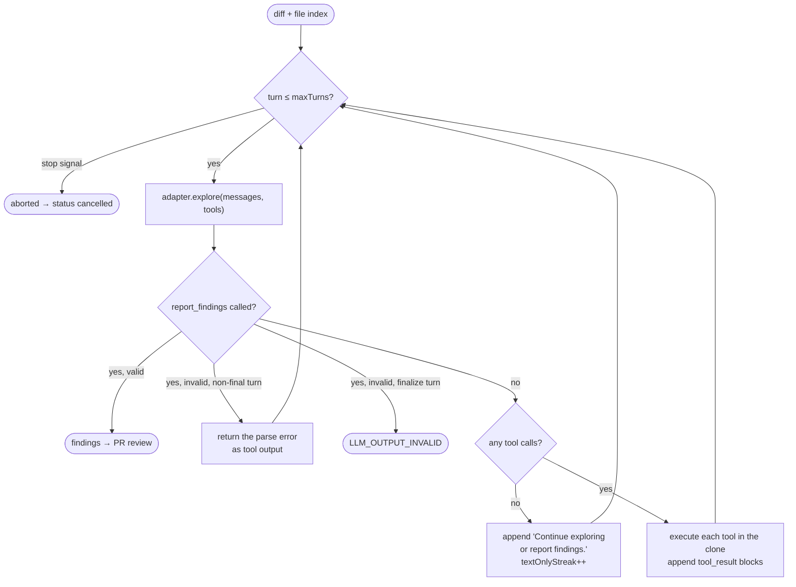

# Agentic review

By default Kitten sends the model everything up front: the diff plus the full contents
of every changed file. **Agentic review** inverts that. The model receives the diff and
an index of what changed, then pulls exactly the context it decides it needs through a
set of read-only tools — and finishes by reporting its findings.

Enable it by adding `.reviewer-mcp.json` to the repository root:

```json
{ "enabled": true }
```

---

## Table of contents

- [When to use it](#when-to-use-it)
- [The loop](#the-loop)
- [The prompt](#the-prompt)
- [Tool reference](#tool-reference)
- [`report_findings`](#report_findings)
- [Safety model](#safety-model)
- [Budgets and cost](#budgets-and-cost)
- [Observability](#observability)
- [Limitations](#limitations)

---

## When to use it

| | Monolithic (default) | Agentic (opt-in) |
|---|---|---|
| Initial context | Diff + full contents of all changed files | Diff + a changed-file index |
| Large PRs | Split into chunks, one LLM call each | One conversation; the diff is truncated if it alone overflows |
| Can inspect unchanged files | No | Yes |
| Can read git history | No | Yes (`git_log`, `git_blame`) |
| Can search the repo | No | Yes (`search`, `find_related`, `semantic_search`) |
| LLM calls | 1 per chunk | 1 per turn, up to `maxTurns + 1` |
| Cost profile | Predictable, proportional to the diff | Variable, driven by how much the model explores |
| Best for | Small, self-contained PRs | Changes whose correctness depends on code outside the diff |

Agentic mode **replaces** chunking rather than composing with it. The context starts
small by design, so per-chunk rounds would be redundant.

---

## The loop



**Turn budget.** The loop runs `turn = 0 .. maxTurns`, i.e. at most `maxTurns + 1`
model calls. The last iteration is a **finalize turn**: `tool_choice` is pinned to
`report_findings`, so the model must produce findings rather than keep exploring.

**Stalling.** Two consecutive turns that return text without any tool call also trigger
a finalize turn. The first text-only turn gets one nudge (`"Continue exploring or
report findings."`); the second ends the exploration.

**Self-correction.** If `report_findings` arrives with a payload that fails
`FindingSchema` on a non-final turn, the Zod error is handed back to the model as a
tool result so it can fix the shape on its next turn. The same failure on the finalize
turn raises `LLM_OUTPUT_INVALID` — there is no turn left to correct it in.

**Unknown tools.** A call to a tool that is not registered returns a structured
`UNKNOWN_TOOL` error listing the tools that *are* available. The loop continues.

**Retries.** Each turn goes through the same retry policy as the monolithic path: three
attempts with 1s/2s/4s backoff on transient failures, and never on authentication
failures.

**Abort.** A `stop` command aborts the loop between turns. The review returns with zero
findings and `aborted: true`, and posts **nothing** — the cancellation status and the
"Review cancelled" comment are produced by the stop handler, not here.

**Reporting without exploring.** If the model calls `report_findings` on its first turn
with zero tool calls, the loop logs a warning: the findings may be weaker than what the
monolithic path would have produced, since the model never looked at any file contents.

---

## The prompt

The system prompt is the **same guardrail prompt as the monolithic path** — review-only
scope, `file:line` precision, no style or praise, no findings the model is unsure of,
the configured `max_findings` and `max_complexity`, and the output language — plus an
appended exploration block:

```
AGENTIC EXPLORATION:
- Explore before reporting: use the tools to inspect the repo beyond the diff — read
  changed files in full, search for usages and patterns, find related code. Do not
  guess what is in the repo — look it up.
- Tools are read-only. You can only read; never attempt to modify anything.
- Budget: you have at most {maxTurns} tool rounds. Spend them on the questions that
  most affect finding quality.
- Finish by calling report_findings with your findings. All precision guardrails above
  still apply.
```

The user message carries, in order: repository conventions (when the conventions file
exists), declared rules, the repository-knowledge block (when knowledge is configured
and returned entries), the diff, and the changed-file index:

```
Changed files (index — read full contents with read_file):
- src/auth/session.ts  (modified, +42 -7, 2.1KB)
- src/auth/token.ts    (added, +88 -0, 3.4KB)
- tests/session.test.ts (modified, +15 -2, 812B)
```

**Reusing the same guardrails is deliberate.** The agentic block only adds capability;
it never relaxes precision. A finding still needs an exact `file:line`, and uncertainty
still means silence.

---

## Tool reference

All seven tools are enabled by default. Restrict them with the `tools` array in
`.reviewer-mcp.json`. Every tool is read-only, root-confined, and capped by the
matching section of that file.

All of them return a `SERVICE_UNAVAILABLE`-style structured error as tool output rather
than throwing, so a bad call costs one turn instead of failing the review:

```json
{ "code": "VALIDATION", "message": "Path is excluded from review: .env" }
```

Results that hit a cap are suffixed with `[truncated]`.

---

### `read_file`

Read a file from the clone. Returns tab-numbered lines.

```json
{ "path": "src/auth/session.ts", "startLine": 40, "endLine": 120 }
```

| Field | Type | Required | Notes |
|---|---|---|---|
| `path` | string | yes | Repository-relative. |
| `startLine` | integer ≥ 1 | no | 1-based, inclusive. Defaults to 1. |
| `endLine` | integer ≥ 1 | no | 1-based, inclusive. Clamped to the file length. |

**Caps:** `read.maxLines` (200) lines, `read.maxFileBytes` (256 KiB) bytes.
**Errors:** `VALIDATION` on a bad shape, a path escaping the root, or an excluded path;
`NOT_FOUND` when the path does not exist or is not a file.

---

### `search`

Regex search across the clone tree, returning `file:line` matches with context.

```json
{ "query": "createSession\\(", "pathGlob": "src/**/*.ts", "caseSensitive": true }
```

| Field | Type | Required | Notes |
|---|---|---|---|
| `query` | string | yes | JavaScript regular expression. Max 500 characters. |
| `pathGlob` | string | no | picomatch glob narrowing which files are searched. |
| `caseSensitive` | boolean | no | Defaults to `search.caseSensitive`. |

**Caps:** `search.maxResults` (30) matches, `search.contextLines` (2) lines of context.
Files larger than `read.maxFileBytes` and files containing a NUL byte are skipped
rather than partially matched. Symlinks are never followed.

**Implementation notes worth knowing:**

- The walk is an in-process JavaScript traversal, not `ripgrep` — the reviewer image
  ships no `rg`, and a JS walk stays unit-testable.
- Matching runs inside a `vm.Script` with a **2-second wall-clock timeout**.
  Catastrophic regex backtracking is uninterruptible from plain JavaScript, but V8 can
  interrupt it mid-regex. A timeout returns
  `VALIDATION: Search timed out after 2000ms — simplify the regex`.

**Errors:** `VALIDATION` on a bad shape, an over-long query, an invalid regex, or a
timeout.

---

### `find_related`

Given a `file:line`, extract the identifier on that line and find its repo-wide
occurrences. The call-site analysis primitive.

```json
{ "file": "src/auth/session.ts", "line": 42 }
```

Identifier extraction is heuristic: the **longest non-keyword, non-numeric token** on
the line, ties going to the leftmost. A list of JavaScript/TypeScript reserved words is
filtered out. The extracted identifier is then regex-escaped, wrapped in `\b…\b`, and
run through `search` with `caseSensitive: true`.

**Caps:** `findRelated.maxResults` (20).
**Errors:** `VALIDATION` on a bad shape or an escaping path; `NOT_FOUND` when the file
does not exist. A line with no usable identifier returns a plain hint to use `search`
directly rather than an error.

"No other occurrences" is only claimed on a **complete** search — a truncated result
may have been cut before reaching other files.

---

### `list_directory`

One level of entries. Directories are suffixed with `/`. Use `"."` for the root.

```json
{ "path": "src/auth" }
```

**Caps:** `listDirectory.maxEntries` (100). Entries are sorted; excluded paths are
filtered out.
**Errors:** `VALIDATION`, `NOT_FOUND` when the path is not a directory.

No recursion by design — the model recurses by calling again, which is what the turn
budget is for.

---

### `git_log`

Commit history for a path, newest first. One commit per line:
`hash<TAB>author<TAB>ISO-date<TAB>subject`.

```json
{ "path": "src/auth/session.ts" }
```

Runs `git log --follow -n {maxCommits + 1} --format=%h%x09%an%x09%aI%x09%s -- <path>`.
The extra commit is fetched purely to detect cap overflow and set the truncation flag.
`--follow` tracks the file across renames.

This works because the clone is **full, not shallow** — a deliberate v2 decision made
precisely so history tools would be possible later.

**Caps:** `gitLog.maxCommits` (20).
**Errors:** `VALIDATION` on an escaping or excluded path; `NOT_FOUND` when `git log`
fails or the path has no history.

---

### `git_blame`

Per-line authorship for a range. One line per source line:
`line<TAB>hash<TAB>author<TAB>ISO-date<TAB>text`.

```json
{ "path": "src/auth/session.ts", "startLine": 40, "endLine": 80 }
```

| Field | Type | Required |
|---|---|---|
| `path` | string | yes |
| `startLine` | integer ≥ 1 | yes |
| `endLine` | integer ≥ 1 | yes |

`endLine` beyond end-of-file is **clamped, not rejected** — agentic callers guess
ranges, and failing them wastes a turn. `startLine > endLine` is a `VALIDATION` error.

Parses `git blame --porcelain`, where author headers appear only the first time a
commit is seen; per-hash metadata is cached to fill in the repeats.

**Caps:** `gitBlame.maxLines` (200).
**Errors:** `VALIDATION`, `NOT_FOUND`.

---

### `semantic_search`

Find code by meaning rather than by text. Useful for "the code that does X" when the
identifiers are unknown.

```json
{ "query": "where do we validate the refresh token expiry?" }
```

| Field | Type | Required | Notes |
|---|---|---|---|
| `query` | string | yes | Natural language or code. Max 500 characters. |

**Only registered when a Semble sidecar is configured** (`SEMBLE_SIDECAR_URL` present,
which the dispatcher sets only when `SEMBLE_IMAGE` is set). Without it the tool is
absent from the model's tool list entirely.

The reviewer never touches the index. It issues `POST {sembleUrl}/search` with
`{ query, top_k }` and a 10-second timeout; the sidecar owns indexing and querying.

When the sidecar is unreachable, unhealthy or returns an unexpected shape, the tool
returns:

```json
{ "code": "SERVICE_UNAVAILABLE",
  "message": "Semble sidecar unreachable: … — use search/find_related instead" }
```

The hint is part of the contract: the model is told, in the failure itself, which tools
to fall back to.

**Caps:** `semanticSearch.maxResults` (10).

More on the sidecar and its index: [deep-context.md](deep-context.md).

---

## `report_findings`

Not a repository tool — the loop's terminator. Always offered, never configurable,
never counted as a tool call.

```json
{
  "findings": [
    {
      "severity": "high",
      "file": "src/auth/session.ts",
      "line": 63,
      "finding": "Session expiry is compared with < instead of <=, so a token expiring exactly now is still accepted.",
      "suggestion": "if (session.expiresAt <= Date.now()) {",
      "ruleId": "auth-expiry"
    }
  ]
}
```

| Field | Required | Notes |
|---|---|---|
| `severity` | yes | `critical` \| `high` \| `medium` \| `low`. Never translated, whatever `language` says. |
| `file` | yes | Repository-relative, copied verbatim from the diff. |
| `line` | yes | Positive integer, new-file side. |
| `finding` | yes | Prose, in the configured language. |
| `suggestion` | no | Rendered as a GitHub ```suggestion block on the inline comment. |
| `ruleId` | no | Only when a rule declared in `.reviewer.yml` was broken. Unknown ids are stripped. |

If the model calls other tools in the same turn as `report_findings`, the report wins
and the siblings are ignored.

---

## Safety model

**No write tool exists.** The registry contains seven executors, all of them readers.
There is no permission to revoke and no flag to get wrong.

**Every path goes through one confinement function.** `confinePath(cloneDir, requested)`
resolves the path against the real path of the clone root and rejects:

- `../` traversal escaping the root,
- absolute paths outside the root,
- symlinks inside the clone pointing outside it — checked by `realpath`-ing the nearest
  **existing** ancestor, so a not-yet-existing path is still validated.

Escapes raise `AppError(VALIDATION)`, which each tool converts into a structured tool
error.

**Exclusions are enforced at the tool boundary.** `.git/` is always excluded regardless
of configuration; `.reviewer.yml`'s `skip` plus `.reviewer-mcp.json`'s `search.skip`
are applied on top. `read_file`, `list_directory`, `git_log`, `git_blame` and the
`search` walk all consult the same `isExcluded` check.

This is currently the **only** layer where exclusions are enforced — the monolithic
path, the diff and the Semble index do not consult them. `semantic_search` results and
`find_related`'s target file are also not checked against the exclusion list. See
[SECURITY.md](../SECURITY.md#known-limitations).

**Tool results are never logged.** Tool *inputs* are logged truncated to 120
characters, with the tool name and duration. Results are not: repository file contents
may contain secrets, and invariant 4 says no secrets in logs.

---

## Budgets and cost

| Control | Where | Effect |
|---|---|---|
| `maxTurns` | `.reviewer-mcp.json` | Hard ceiling on exploration rounds (default 12). |
| `forceMaxTurns` | `.reviewer-mcp.json` | The ceiling used after `@reviewer force` (default 60). |
| `max_context_tokens` | `.reviewer.yml` | Guards the **initial** prompt. If the diff alone overflows, it is halved repeatedly until it fits and the review continues — the model can recover the missing context with `read_file`. |
| `max_output_tokens` | `.reviewer.yml` | Per-turn output cap. |
| Per-tool caps | `.reviewer-mcp.json` | Bound how much text any single tool result can add to the conversation. |

Two situations invite the reviewer to reply `force`, each with its own comment:

- **The diff was truncated** to fit `max_context_tokens`.
- **The turn budget was exhausted** — the loop reached `maxTurns` and had to finalize.
  The comment names the number of tool calls spent.

Because every turn resends the whole conversation, cost grows super-linearly with turn
count. `maxTurns: 12` is a deliberate default, not a placeholder.

---

## Observability

The Pod logs one line per turn and one per tool call:

```
[reviewer] Agentic mode enabled (maxTurns=12, tools=read_file,search,find_related,…)
[reviewer] Turn 1/13: 8214 in / 176 out tokens
[reviewer] Turn 1/13: list_directory({"path":"src/auth"}) 3ms
[reviewer] Turn 2/13: 8944 in / 412 out tokens
[reviewer] Turn 2/13: read_file({"path":"src/auth/session.ts","startLine":1}) 2ms
[reviewer] Agentic loop done: 7 tool calls, hitBudget=false
[reviewer] LLM review complete: 4 findings
```

Input and output tokens are summed across every turn and reported in the review
metadata, so the real cost of an agentic review is visible rather than estimated.

---

## Limitations

- **`find_related` is lexical, not semantic.** It extracts an identifier and greps for
  it. It does not resolve types, imports or overloads. `semantic_search` complements it
  but is a different retrieval mechanism, not a language server.
- **Identifier extraction is a heuristic.** "Longest non-keyword token" picks the wrong
  symbol on dense lines.
- **`search` has no `ripgrep`-class performance.** It is a JavaScript walk with a
  2-second budget. Very large repositories will hit that budget on broad patterns.
- **Turn budgets are not adaptive.** The model gets the same ceiling for a one-line fix
  and a thousand-line refactor.
- **No cross-review memory of exploration.** Every review starts from scratch. The only
  state that persists is the Semble index and the knowledge store.
