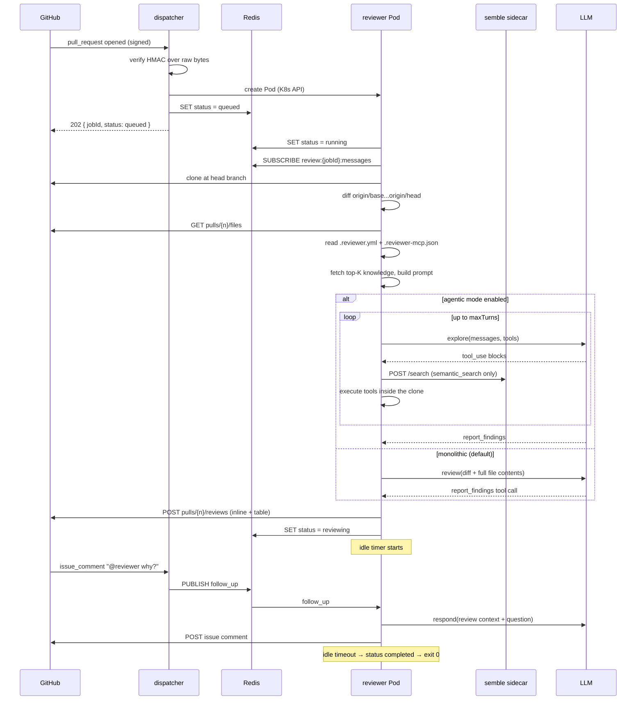

# Architecture

How Kitten is put together, what each component owns, and which properties the system
guarantees. For endpoint contracts see [api.md](api.md); for every knob see
[configuration.md](configuration.md).

---

## Table of contents

- [Design principles](#design-principles)
- [Components](#components)
- [The review pipeline](#the-review-pipeline)
- [Review strategies](#review-strategies)
- [Job state model](#job-state-model)
- [Messaging](#messaging)
- [Data stores](#data-stores)
- [Error model](#error-model)
- [Failure containment](#failure-containment)
- [System invariants](#system-invariants)
- [Package dependency graph](#package-dependency-graph)

---

## Design principles

**One Pod per review.** Not a worker pool, not a queue of jobs sharing a process. Each
review gets its own Kubernetes Pod with `restartPolicy: Never`, its own clone, its own
memory. A pathological repository cannot starve another review, and a crashed review
cannot corrupt one running next to it.

**The Pod is the agent.** The Pod does not exit when the review is posted. It reports
`reviewing`, subscribes to a Redis channel, and stays available to answer follow-up
questions with the original review still in its context — then shuts itself down on an
idle timer. This is why Kitten uses bare Pods rather than Kubernetes Jobs: a Job's
completion semantics fight the "stay alive and converse" model.

**Configuration belongs to the reviewed repository.** The deployment supplies
infrastructure (cluster, Redis, secrets); the repository being reviewed supplies the
review contract (`.reviewer.yml`, `.reviewer-mcp.json`). One Kitten deployment serves
repositories with different models, languages, rules and budgets.

**Read-only by construction, not by policy.** The agent's tool layer contains no write
tool. There is nothing to disable, no permission to forget to revoke. Every tool
resolves paths through a single confinement function that rejects traversal, absolute
escapes and symlinks pointing outside the clone.

**Degrade, never fail.** Optional capabilities — the semantic index, the knowledge
store, the conventions file — are additive. When their dependencies are absent or
broken, the affected feature logs a warning and the review proceeds without it.

---

## Components

### `@kitten/shared`

The contract layer. Depended on by both services, ships nothing runnable.

| Module | Responsibility |
|---|---|
| `types/` | Zod schemas and inferred types: `ReviewJob`, `Finding`, `ReviewResult`, `ReviewJobStatus`, `PubSubMessage`, `PullRequestFile`, `ReviewerConfig`, plus the `AppError` class. |
| `config/` | `parseReviewerConfig` (`.reviewer.yml` → `ReviewerConfig`), `parseMcpConfig` (`.reviewer-mcp.json` → `MCPConfig`), and `DEFAULT_CONFIG` / `DEFAULT_MCP_CONFIG`. |
| `llm/` | The `LLMAdapter` interface and its two implementations (`AnthropicAdapter`, `OpenAIAdapter`), plus `createLlmAdapter` — the factory that picks the SDK from `provider` and the API key from `base_url`. |
| `knowledge/` | `createKnowledgeClient` — MongoDB Atlas Vector Search + Voyage embeddings. Returns `undefined` when its secrets are absent, which is how every caller learns the feature is off. |

`LLMAdapter` has exactly three methods, and each exists for a distinct call shape:

```ts
review(context)                          // one-shot structured review → Finding[]
respond(system, user, maxOutputTokens)   // free text → follow-up answers
explore(turn)                            // one agentic turn → tool calls + text
```

Adding a provider means implementing this interface and registering it in the factory.
Nothing else in the codebase knows a vendor's name.

### `@kitten/dispatcher`

A long-lived Express 5 service. Stateless except for its Redis and Kubernetes clients.

- **Routes** — `/health`, `/review`, `/status/:jobId`, `/review/:jobId/message`,
  `/webhook/github`. Each is a factory (`createXRouter(deps)`) so tests inject fakes.
- **Webhook layer** — HMAC verification over raw bytes, event routing, and two shared
  helpers (`dispatchReview`, `publishFollowUp`) that the HTTP routes and the webhook
  both call. They were extracted specifically so the two entrypoints cannot drift.
- **K8s layer** — `K8sClient` wraps `CoreV1Api` (in-cluster config, falling back to
  the local kubeconfig); `buildPodManifest` produces the reviewer Pod, including the
  optional Semble sidecar and all Secret references. The Pod spec is generated in
  code, so no kustomize overlay can reach it; the three scheduling fields an
  operator can influence — `nodeSelector`, `tolerations` and `serviceAccountName` —
  arrive via the `REVIEWER_POD_SCHEDULING` environment variable
  ([configuration.md](configuration.md#reviewer-pod-scheduling)).

The dispatcher never talks to an LLM and never reads repository code. Its only
knowledge-store interaction is writing entries captured from PR comments.

### `@kitten/reviewer`

The agent. Runs once per PR inside its Pod and owns the entire review.

| Module | Responsibility |
|---|---|
| `index.ts` | Entrypoint. Validates injected environment, reports `running`, subscribes **before** the pipeline starts (a `stop` sent mid-review must land), runs the pipeline, hands off to the agent lifecycle. |
| `pipeline.ts` | The review itself: clone → diff → PR files → config → knowledge → prompt → LLM → post → cleanup. |
| `agent.ts` | Post-review lifecycle: idle timer, follow-up handling, `force` / `stop` / `re_review`, SIGTERM. |
| `git/` | Authenticated clone, three-dot diff, `pulls.listFiles` fetch with skip filtering, changed-file reads. |
| `prompt/` | The guardrail system prompt and the knowledge block. |
| `agentic/` | The multi-turn exploration loop and its prompt. |
| `mcp/` | The seven read-only tools plus path confinement. |
| `chunker/` | Token estimation, budget splitting, cross-chunk consolidation. |
| `github/` | Posting: PR reviews with inline comments, issue comments, PR metadata. |
| `redis/` | Status writes and pub/sub subscription. |

### `semble-sidecar`

A Python container sharing the Pod's network namespace and clone volume. Semble's MCP
server speaks stdio only, which cannot cross a container boundary, so this shim spawns
it as a subprocess and exposes `GET /health` and `POST /search` on `127.0.0.1:8765`.
Its index lives on a PersistentVolumeClaim keyed by repository and base branch, so runs
against the same base reuse it.

---

## The review pipeline

Every numbered step below is a stage of `runPipeline`. Cleanup runs in a `finally`
block, so it executes on every path including a thrown error.



**1. Clone.** A full clone (all refs — `git_log` and `git_blame` need history) with the
PR head branch checked out. Everything read from the worktree afterwards — config
files, conventions, agentic tool reads — therefore sees the head, not the default
branch. The URL carries the token; every error path replaces the token with `***`
before the message is ever constructed.

**2. Diff.** `git diff origin/{base}...origin/{head}` (three-dot: changes on the head
side since the merge base) plus a summary for insertion/deletion counts.

**3. PR files.** `pulls.listFiles` supplies the authoritative changed-file list with
per-file patches — needed later to decide whether a finding can anchor inline. A PR at
GitHub's 3000-file API limit logs a warning. The call accepts a skip-pattern argument,
but the pipeline currently passes an empty array, so `.reviewer.yml`'s `skip` does
**not** filter this list — see
[configuration.md](configuration.md#skip-patterns).

**4. Config.** `.reviewer.yml` and `.reviewer-mcp.json` are read from the clone root.
Missing or unreadable → defaults. **Invalid → defaults, with the parse error swallowed
for `.reviewer.yml` and logged as a warning for `.reviewer-mcp.json`.** A malformed
config never fails a review.

**5. Files and knowledge.** Changed files are read from the clone (paths from the
GitHub API are untrusted input, so each resolved path is asserted to stay inside the
clone). Top-K knowledge entries are retrieved by vector similarity to the diff.

**6. Prompt.** `buildGuardrailSystem` produces the system prompt: review-only scope,
precision requirements (`file:line` mandatory), noise suppression (no style, no
praise, no findings you are unsure about), the configured limits, the output language,
and — conditionally — the repository-rules and repository-knowledge blocks. Those two
blocks are conditional on purpose: naming `ruleId` in a repo that declares no rules
invites invented attributions.

**7. LLM.** The adapter is built from the resolved config. Transient failures retry
three times with 1s/2s/4s backoff; authentication failures never retry, because they
cannot heal by waiting.

**8. Post.** Findings become a GitHub Pull Request Review. Zero findings still produce
a comment stating so. Over-budget reviews append an invitation to reply `force`.

**9. Cleanup.** `fs.rmSync(cloneDir, { recursive: true, force: true })`.

---

## Review strategies

### Monolithic (default)

The prompt carries the diff and the **full content of every changed file**. When the
estimated prompt exceeds `max_context_tokens`, files are sorted largest-first and
packed into chunks; each chunk is a separate LLM call re-sending the same system
prompt and diff, and the results are consolidated.

Consolidation deduplicates on `file:line`, keeps the highest severity on conflict,
preserves first-seen order, and strips `ruleId` values the repository never declared —
the finding survives, only the false attribution is dropped.

A chunk that fails is skipped and reported (`⚠️ N of M chunks failed`). A **single**
call that fails is a review failure: there is no other chunk to fall back on.

### Agentic (opt-in)

Enabled by `{"enabled": true}` in `.reviewer-mcp.json`. The prompt carries the diff and
a **changed-file index** — path, status, line counts, patch size — instead of file
contents. The model then explores through tools and finishes by calling
`report_findings`.

The loop is bounded by `maxTurns` (`forceMaxTurns` under `force`). Two consecutive
text-only turns, or the last turn, trigger a **finalize turn** with `tool_choice`
pinned to `report_findings`. Invalid findings on a non-final turn are returned to the
model as a tool error so it can correct itself; invalid findings on the finalize turn
raise `LLM_OUTPUT_INVALID`.

If the initial agentic prompt still exceeds `max_context_tokens`, the diff is halved
repeatedly until it fits and the review continues — the model can recover the missing
context through `read_file`. The PR then receives an invitation to reply `force`.

Agentic mode **replaces** chunking rather than composing with it: the context starts
small by design, so per-chunk rounds would be redundant.

---

## Job state model

```
        POST /review
        or webhook          Pod boots         pipeline done      idle / SIGTERM /
             │                  │                   │            shutdown message
             ▼                  ▼                   ▼                   ▼
         ┌────────┐        ┌─────────┐        ┌───────────┐        ┌───────────┐
         │ queued │───────►│ running │───────►│ reviewing │───────►│ completed │
         └────────┘        └─────────┘        └───────────┘        └───────────┘
                                │                   │
                    pipeline    │                   │  stop
                    failure     ▼                   ▼
                          ┌──────────┐        ┌───────────┐
                          │  failed  │        │ cancelled │
                          └──────────┘        └───────────┘
```

`completed`, `failed` and `cancelled` are **terminal**: follow-up messages to a job in
one of these states are rejected (`404` on the HTTP route, ignored delivery on the
webhook). Terminal transitions also stamp `completedAt`.

`running` is re-entered during an in-place re-review, which returns to `reviewing` when
the second pipeline run finishes.

---

## Messaging

Redis serves two purposes and nothing else.

**Status** — key `review:{jobId}:status`, a JSON `ReviewJobStatus`. Written by the
dispatcher on creation and by the Pod at each transition. Read by `GET /status/:jobId`,
by the active-job check before publishing a follow-up, and by the webhook to decide
between an in-place re-review and a fresh Pod.

**Commands** — channel `review:{jobId}:messages`, carrying `PubSubMessage`:

| `type` | Payload | Meaning |
|---|---|---|
| `follow_up` | `{ message, sender }` | A command (`force`, `stop`) or a question. |
| `re_review` | `{}` | New commits pushed; re-run the pipeline in place. |
| `shutdown` | `{}` | Terminate cleanly and report `completed`. |

Publication is **fire-and-forget**. If the Pod is gone the message is lost, by design.
The dispatcher guards against that by checking the stored status first, and — for
`re_review` — by inspecting the subscriber count `PUBLISH` returns: zero subscribers
means the Redis key outlived the Pod, so a fresh Pod is dispatched instead.

Malformed messages are validated with Zod, logged, and skipped. They never crash the
subscriber.

---

## Data stores

Job isolation is absolute for the filesystem. Only two stores are allowed to outlive a
job, and both are explicitly designated:

| Store | Contents | Rebuildable? |
|---|---|---|
| Semble index PVC (`kitten-semble-index`) | Code embeddings, keyed `{repo}/{baseRef}` | Yes — derived from the repository, safe to delete. |
| Atlas `kitten.knowledge` collection | Team-curated facts and human corrections, with Voyage embeddings | No — curated by humans. |

Redis holds only ephemeral job state. The clone directory is per-Pod and always
removed.

---

## Error model

Every failure in the system is an `AppError { code, message, details? }` — never a bare
string. Ten codes exist:

`VALIDATION` · `NOT_FOUND` · `DUPLICATE` · `SERVICE_UNAVAILABLE` · `AUTH_FAILED` ·
`RATE_LIMITED` · `UNPROCESSABLE` · `GITHUB_API_ERROR` · `LLM_OUTPUT_INVALID` ·
`UNKNOWN_TOOL`

The dispatcher's global error handler maps them to HTTP status codes; see
[api.md](api.md#error-format). Codes without an explicit mapping become `500`, and
unknown non-`AppError` exceptions become `500 INTERNAL` with the original message
logged but never returned — errors must not leak internals to a webhook caller.

---

## Failure containment

The system is built so that optional things failing never takes down mandatory things.

| Failure | Consequence |
|---|---|
| `.reviewer.yml` missing / invalid | Defaults are used. Review proceeds. |
| `.reviewer-mcp.json` invalid | Warning; falls back to the monolithic path. Review proceeds. |
| Conventions file missing | Prompt omits the conventions block. Review proceeds. |
| Knowledge secrets unset | Warning at boot; `remember` and corrections are ignored, no knowledge block. Review proceeds. |
| Knowledge retrieval throws | Warning; empty knowledge block. Review proceeds. |
| Semble sidecar absent / unhealthy | `semantic_search` is not registered (or returns `SERVICE_UNAVAILABLE` with a hint to use `search` / `find_related`). Review proceeds. |
| Semble PVC absent | Sidecar falls back to `emptyDir` — a fresh index every run, no persistence. |
| One chunk of a multi-chunk review fails | That chunk's findings are skipped; a warning comment is posted. Review proceeds. |
| A single-call review fails | The review fails; status `failed`, exit code 1. |
| `REQUEST_CHANGES` rejected with 422 | Retried as a plain comment, with a visible note explaining the merge is **not** gated. |
| Posting a comment fails | Logged, non-fatal. |
| Clone fails | `AppError(NOT_FOUND)`, review fails, clone dir still cleaned up. |
| LLM auth fails | `AppError(AUTH_FAILED)`. Never retried. |
| Webhook payload malformed | Acknowledged as ignored — GitHub must never be left retrying a delivery that will never be consumed. |

---

## System invariants

Violating any of these is a bug, not a design trade-off.

1. **The reviewer never mutates the cloned repository.** Access is read-only.
2. **Clone directories are always cleaned up** — including on error and crash.
3. **Structured errors everywhere** — `{ code, message, details }`, never bare strings.
4. **No secrets in logs.** Tokens, API keys and webhook secrets are never logged. Tool
   *inputs* are logged truncated; tool *results* are never logged, because repository
   file contents may contain secrets.
5. **Job isolation.** Each review is independent. Filesystem and clone isolation are
   absolute; cross-job state is permitted only in the two stores named above.

---

## Package dependency graph

```
              ┌──────────────────┐
              │  @kitten/shared  │   types · config parsers · LLM adapters · knowledge
              └────────┬─────────┘
                       │
          ┌────────────┴────────────┐
          ▼                         ▼
┌────────────────────┐    ┌───────────────────┐
│ @kitten/dispatcher │    │ @kitten/reviewer  │
│  express · k8s     │    │  simple-git       │
│  ioredis           │    │  octokit          │
│                    │    │  ioredis          │
│                    │    │  picomatch        │
└────────────────────┘    └───────────────────┘
```

The two services never import each other. Their only shared runtime surfaces are the
Redis key/channel conventions and the environment-variable contract of the Pod
manifest — both defined in code the dispatcher owns and the reviewer consumes.
